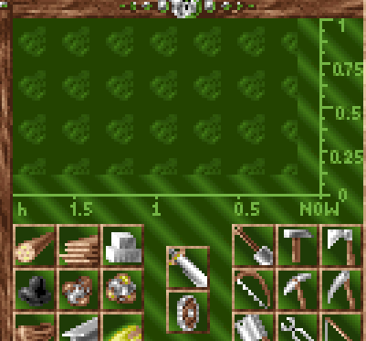

# Production chart background not fitting chart

The background of the production statistics window is not fitting the diagram.

## The problem / how to reproduce

* in a game, click on the `Statistics` icon in the bottom menu bar (Hotkey: `4`)
* select lower left icon (`Production charts`)
* browse the goods / products that have no or litte production to see the problem better
* you will notice, that the overlay background of the selected good does not fit the chart background and there is a margin on the right and bottom axis of the chart

## My environment

* Win 11, 64
* Serflings 2.0.0 (with integrated JRE)
* Map: `BLADE` (campaign mission #19)
* Original game file: `SPAE.PA`

## Thanks

Thank you, `nicymike`, for the awesome "Serfings Remake Project". I hope this can help finding / resolving bugs and make it an even better game.
